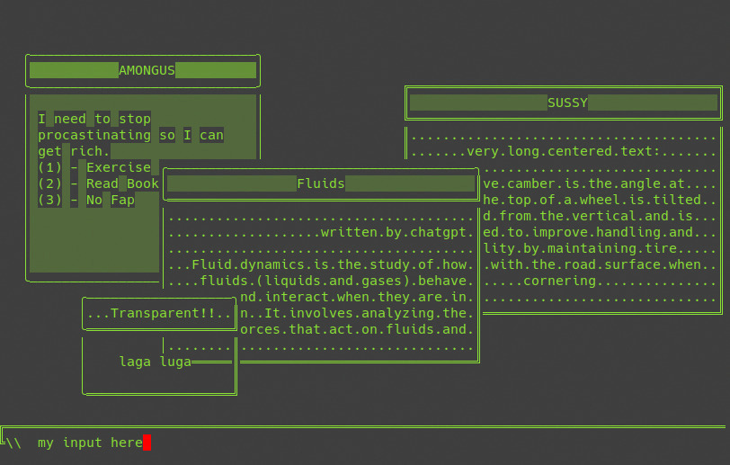
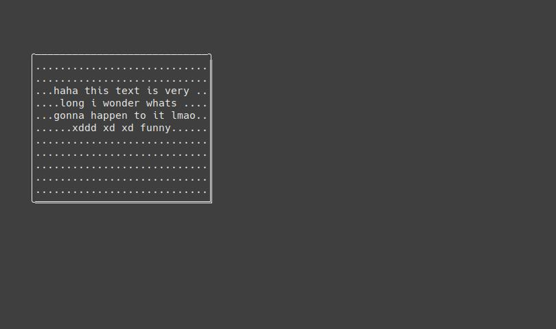
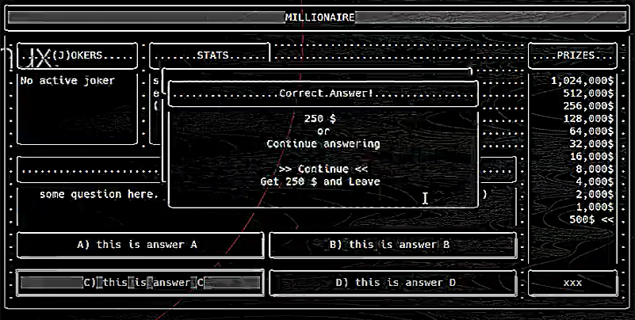

# LightCli
 simple command line interface graphics library thingy.. its for learning purposes.  
 
 ## Context
  - [What is this?](#what-is-this)
    - explanation and purpose of the project
  - [Features](#features)
  - [Showcase](#showcase)
  - [usage](#usage)
 
 ## What is this
 this is my first somewhat successful attempt to create something like library (i still dont know enough to work around these small things) that can be used to create a simple ascii powered graphical user interface. what i mean is it can just show boxes and text. thats all.
 
 ## Features
 - very abstract classes
 - custom ascii resolution(main window dimensions)
 - basic rectangle support 
   - few different border styles (easy to add more)
   - filling styles(easy to add more). supports no filling too (transparent)
 - crude textbox support
   - `"'\` etc breaks it
   - auto line break (if it detects the word `#breakLine#` it will forcefully break the line. this info will help you in custom boilerplates)
   - 3 different horizontal aligning ways
   - padding from rectangle that applies to textbox. textbox is a part of rectangle thingy (i call the whole thing CONTENT).
   - (tbh i might call it CONTENT or rectangle or window or idk not sure yet about the terminology)  
## How to use it
just copy paste the code if you want. that would work ig. 

## Showcase
You might be saying "damn thats crazy". but hear me out. since these are very abstract simple stuff.. i can create custom boilerplate classes to create fancy stuff made by these simple _primitives_




what you are seeing in this image (talking about the floating rectangles) is few instances of a custom boilerplate i made that uses my primitive CONTENT class (this boilerplate is currently in the code)
(what you will see is probably going to be black and white. because if i get into this color thing ill die from dehydration)

## usage
`LCLI` class is basically your ascii screen. yeah no need to explain further  
```C#
//90 characters wide, 25 characters tall
LCLI cli = new LCLI(90,25);

//render the screen (outputs text to console)
cli.renderScreen();
```

`LCLI_Content` class is a rectangle that can carry some text  
```C#
//create Content
LCLI_Content w1 = new LCLI_Content(5, 3, 30, 13, 3, 1); //x, y, width, height, borderStyle, brightnessStyle
//add some text to that content if you want
w1.text = "haha this text is very long i wonder whats gonna happen to it lmaoo xddd xd xd funny";
//align the text left/center/right (-1,0,1)
w1.textAlign = 0;
//change the padding (default 2)
w1.textPadding = 3;
//padding 0 will cause text to slip under borders

//render it on your screen (you still need to render the screen after this)
cli.addContent(w1);
```
thats all. final code will look something like this
```C#
LCLI cli = new LCLI(90,25);

LCLI_Content w1 = new LCLI_Content(5, 3, 30, 13, 3, 1); //x, y, width, height, borderStyle, brightnessStyle
w1.text = "haha this text is very long i wonder whats gonna happen to it lmaoo xddd xd xd funny";
w1.textAlign = 0;
w1.textPadding = 3;
cli.addContent(w1);

cli.renderScreen();
```



## whats more
you can just create a simple class to receive simpler parameters and constructs a fancier window.

built in boilerplate usage:  
```C#
/*                
 LCLI_BoilerPlateWindow myWindow = new LCLI_BoilerPlateWindow(
     xCoords, 
     yCoords, 
     width, 
     height, 
     borderStyle, 
     brightness, 
     "Title", 
     new string[]{"text1(first line)","text2(force another line)"},
     textAlign);

 myWindow.showOn(LCLI OBJECT HERE);
*/

LCLI_BoilerPlateWindow w1 = new LCLI_BoilerPlateWindow(3, 3, 30, 15, 1, 2, "COOL", new string[] { "I need to stop procastinating", "(1) - Exercise", "(2) - Read Books", "(3) - Git gud" }, -1);
w1.showOn(cli);
```
this boilerplate has:  
 - a window (a big rectangle with given size)
 - a title(a narrow rectangle with center aligned text)
 - an array of strings. each element will be forced to be in a new line (a transparent rectangle with text on it)

`w1.showOn(cli);` is basically adding these 3 Contents to the given LCLI object with `addContent();`. **order matters**

## Example Showcase


## Still Confused?
me too!

 
 ##### notes: 
 this is a monodevelop project folder. i dont know much about C languages. this was my practice project.  
 imagine coding 15 hours in 2 days to learn C# and clis instead of watching an hour long tutorial and completing the task. 
 
 this is definitely one of the READMEs of all time
